<div align="center">

# TextSage

### Turn any school textbook PDF into a fully local AI tutor — in minutes.

*Extract · Align · Chunk · Embed · Chat*

[](https://python.org)
[](https://fastapi.tiangolo.com)
[](https://qdrant.tech)
[](https://postgresql.org)
[](https://ollama.com)
[](LICENSE)

---

**TextSage** is a local-first Retrieval-Augmented Generation (RAG) pipeline that ingests school textbook PDFs and transforms them into a fully queryable, streaming AI tutor — with no cloud dependency at inference time.

It accurately extracts text and diagrams, aligns every chapter to its exact PDF page, creates topic-level chunks with figure metadata, stores everything in PostgreSQL + Qdrant, and serves it through a streaming chat UI backed by a local LLM running on Ollama.

</div>

---

## What makes TextSage different

| Capability | How |
|---|---|
| **Curriculum-aware chunking** | Chunks follow the ToC hierarchy: Class → Subject → Chapter → Topic → Page. Not just fixed-size windows. |
| **Exact chapter alignment** | 3-stage pipeline: BM25 keyword match + Qdrant vector search + LLM tiebreaker. Finds the true first page of every chapter. |
| **Smart extractor selection** | MinerU for science subjects (handles LaTeX equations), PyMuPDF for language subjects (faster). Auto-detected per book. |
| **Figures in answers** | Images are extracted, linked to their page + figure number, stored in PostgreSQL, and returned alongside LLM answers. |
| **Fully local inference** | Ollama + Gemma 4B runs on a GTX 1060 (6 GB VRAM). No cloud API needed at chat time. |
| **Resumable pipeline** | Every phase is independently re-runnable. Stop mid-extraction, restart, and it picks up where it left off. |

---

## Demo flow

```
Student asks: "Explain electromagnetic induction"
        │
        ▼
TextSage embeds the question (BGE-base)
        │
        ▼
Qdrant finds top-5 matching chunks from the relevant textbook
filtered by subject and class
        │
        ▼
PostgreSQL fetches full chunk text + linked figure images
        │
        ▼
Ollama streams a grounded answer from Gemma 4B
using ONLY the retrieved textbook passages
        │
        ▼
Frontend renders text stream + figure images in real time
```

---

## Architecture

> Knowledge graph built from 419 nodes · 618 edges · 25 communities across the entire codebase.

```mermaid
flowchart TD
    subgraph INPUT["📂 Input"]
        PDF["📄 PDF Files\n(PDFSource/)"]
    end

    subgraph PHASE1["⚙️ Phase 1 — Extract  ·  pipeline.py"]
        SPLIT["pdf_splitter\nSplit into per-page PDFs"]
        SUBJ["subject_identifier\nGroq vision → subject / class / part"]
        EXT{"Extractor\nchoice"}
        MINERU["mineru_extractor\nMinerU CLI\nper-page .txt + content_list.json\nLaTeX equations preserved"]
        PYMUPDF["text_extractor\nPyMuPDF parallel\n8 threads"]
        TOC_D["toc_detector\nKeyword scan → ToC page numbers"]
        TOC_E["toc_extractor\nGroq vision → toc.json\nfull hierarchy"]
        MANIF["manifest_manager\nWrite manifest.json\nper-book source of truth"]
    end

    subgraph PHASE2["🔢 Phase 2 — Embed Pages  ·  page_embedder.py"]
        PEMB["BGE-base-en-v1.5\nEmbed each page text"]
        REDIS1[("Redis\n7-day embedding cache")]
        QPAGES[("Qdrant\ntextbook_pages collection")]
    end

    subgraph PHASE3["📐 Phase 3 — Align Chapters  ·  chapter_aligner.py"]
        FEAT["chapter_start_features\nLayout + text signals\nper candidate page"]
        BM25["BM25Okapi\nKeyword match\nnormalized score"]
        QSEM["Qdrant search\nVector similarity\nTop-15 candidates"]
        RERANK["Structural reranking\n0.5×vector + 0.5×BM25\n× 0.85 structural weight"]
        LLM_TIE["llm_client → Groq\nLLM tiebreaker\nonly when margin < 0.18"]
        CHAPMAP["chapter_page_map.json\nchapter → confirmed PDF page"]
    end

    subgraph PHASE4["✂️ Phase 4 — Chunk  ·  chunker.py"]
        TRANGE["Build topic page ranges\nfrom ToC offset + chapter map"]
        CHUNKS["chunks.json\n1 chunk per topic×page pair\n~400 words · 15% overlap\nboundary pages duplicated"]
    end

    subgraph IMGPIPE["🖼️ Image Pipeline  ·  image_extractor + mineru_image_builder"]
        IMGEXT["image_extractor\nDetect figure captions\nCrop + render regions"]
        IMGIDX["mineru_image_builder\nBuild images_index.json\npage → topic mapping"]
        KB["knowledge_base_builder\nMerge chunks + images\nInline equations extracted"]
    end

    subgraph PHASE5["🗄️ Phase 5 — Write DB  ·  pg_writer.py"]
        PG[("PostgreSQL\ntextbook_books\ntextbook_chunks\ntextbook_images\nUUID primary keys\nON DELETE CASCADE")]
    end

    subgraph PHASE6["🧮 Phase 6 — Embed Chunks  ·  chunk_embedder.py"]
        CEMB["BGE-base-en-v1.5\nEmbed each chunk"]
        QCHUNKS[("Qdrant\ntextbook_chunks collection\nsubject + class_number payload")]
    end

    subgraph SERVE["💬 Phase 7 — Serve  ·  api_server.py"]
        FE["frontend/index.html\nVanilla JS\nSSE streaming chat\nclass + subject selector"]
        API["FastAPI\nGET  /api/classes\nGET  /api/subjects\nPOST /api/chat\nGET  /api/images/{id}"]
        SQBUILD["_build_search_query\nFollow-up context injection\nfor short questions"]
        EMBED_Q["get_embedder()\nEmbed question\nRedis cache hit"]
        QSEARCH["Qdrant query\nTop-5 chunks\nfiltered by subject + class"]
        PGFETCH["PostgreSQL\nFull chunk text\nLinked figure images\nFig ref regex extraction"]
        OLLAMA["Ollama · Gemma 4B\nUser-turn context injection\nStreaming SSE tokens"]
    end

    subgraph INFRA["🔧 Infrastructure"]
        REDIS[("Redis\nEmbedding cache\n7-day TTL")]
        CONFIG["config.py\n.env → all settings\nauto-create dirs"]
        LOGGER["logger.py\nStructured logging"]
        TIMER["StepTimer\nPer-phase timing"]
        RESUME["resume_check\nskip / resume / chunk-only\nper book"]
    end

    PDF --> SPLIT
    SPLIT --> SUBJ
    SUBJ --> EXT
    EXT -->|"science\nphysics · chem · bio · math"| MINERU
    EXT -->|"language\nenglish · hindi · history…"| PYMUPDF
    MINERU --> TOC_D
    PYMUPDF --> TOC_D
    MINERU --> MANIF
    PYMUPDF --> MANIF
    TOC_D --> TOC_E
    TOC_E --> MANIF

    MANIF --> PEMB
    PEMB <-.->|"cache lookup"| REDIS1
    PEMB --> QPAGES

    MANIF --> FEAT
    FEAT --> BM25
    FEAT --> QSEM
    QPAGES -.->|"vector search"| QSEM
    BM25 --> RERANK
    QSEM --> RERANK
    RERANK -->|"margin ≥ 0.18\nauto-confirm"| CHAPMAP
    RERANK -->|"margin < 0.18\nambiguous"| LLM_TIE
    LLM_TIE --> CHAPMAP

    CHAPMAP --> TRANGE
    MANIF --> TRANGE
    TRANGE --> CHUNKS

    MINERU -->|"content_list.json"| IMGEXT
    IMGEXT --> IMGIDX
    CHUNKS --> KB
    IMGIDX --> KB

    KB --> PG
    CHUNKS --> PG

    PG --> CEMB
    CEMB --> QCHUNKS
    CEMB -->|"write qdrant_point_id"| PG

    FE -->|"POST /api/chat"| API
    API --> SQBUILD
    SQBUILD --> EMBED_Q
    EMBED_Q <-.->|"cache"| REDIS
    EMBED_Q --> QSEARCH
    QCHUNKS -.->|"vector search"| QSEARCH
    QSEARCH --> PGFETCH
    PG -.->|"chunks + images"| PGFETCH
    PGFETCH --> OLLAMA
    OLLAMA -->|"SSE token stream"| FE

    CONFIG -.-> PHASE1
    CONFIG -.-> PHASE2
    CONFIG -.-> PHASE3
    CONFIG -.-> SERVE
    LOGGER -.-> PHASE1
    TIMER -.-> PHASE1
    RESUME -.-> PHASE1

    classDef phase fill:#1a2f4a,stroke:#4a90d9,color:#e8f4fd,rx:8
    classDef store fill:#1a3a1a,stroke:#5cb85c,color:#e8f5e8
    classDef llm fill:#3a1a1a,stroke:#d9534f,color:#fde8e8
    classDef infra fill:#2a2a2a,stroke:#888,color:#ccc
    classDef input fill:#1a3a2a,stroke:#5cb85c,color:#e8f5ee

    class PHASE1,PHASE2,PHASE3,PHASE4,IMGPIPE,PHASE5,PHASE6,SERVE phase
    class QPAGES,QCHUNKS,PG,REDIS,REDIS1 store
    class MINERU,SUBJ,TOC_E,LLM_TIE,OLLAMA llm
    class CONFIG,LOGGER,TIMER,RESUME infra
    class PDF,INPUT input
```



### Module community map

> Derived from knowledge graph community detection (Louvain algorithm, 25 communities found).

| Community | Key Modules | Role |
|---|---|---|
| **Main Pipeline Orchestrator** | `main.py` · `pipeline.py` · `resume_check.py` · `manifest_validator.py` | Entry point, phase sequencing, resume logic |
| **Chapter Alignment Strategy** | `chapter_aligner.py` · `chapter_start_features.py` | 3-stage BM25 + vector + LLM chapter detection |
| **Chunker (Topic Map)** | `chunker.py` — topic-range builder, dedup, boundary logic | Convert ToC offsets to page ranges |
| **Chunker (Book Level)** | `chunker.py` — `chunk_all_books`, `chunk_book` | Orchestrate chunking across all books |
| **Embedding & Page Indexing** | `page_embedder.py` · `embedder.py` | Page-level BGE embeddings + Qdrant upsert |
| **Embedder Cache Layer** | `embedder.py` — `Embedder` class, Redis cache | Singleton embedder, 7-day Redis TTL |
| **LLM Client (Groq/Gemma)** | `llm_client.py` | Unified router: Groq cloud or Ollama local |
| **Ollama Local Client** | `ollama_client.py` | Thin Ollama wrapper, JSON mode, multiturn |
| **API Server & REST** | `api_server.py` · FastAPI routes | RAG query, SSE streaming, image serving |
| **AITutor Frontend** | `frontend/index.html` | Vanilla JS chat UI, class/subject picker |
| **MinerU Extractor** | `mineru_extractor.py` | MinerU CLI runner, block→text, LaTeX |
| **Image Pipeline** | `image_extractor.py` · `mineru_image_builder.py` | Figure crop, caption detect, index build |
| **PostgreSQL Writer** | `pg_writer.py` | Schema DDL, bulk upsert, image loader |
| **Dependencies** | PyMuPDF · pypdf · pdfplumber · pytesseract · sentence-transformers · qdrant-client · psycopg2 · redis | Third-party library layer |

---

## Tech stack

| Layer | Technology | Purpose |
|---|---|---|
| PDF extraction (science) | [MinerU](https://github.com/opendatalab/MinerU) | Structured text + LaTeX equation preservation |
| PDF extraction (language) | [PyMuPDF](https://pymupdf.readthedocs.io) | Fast parallel per-page extraction |
| OCR fallback | pytesseract + Pillow | Image-only pages |
| Subject / ToC identification | Groq · Llama 4 Scout 17B (vision) | Identify subject, class, parse ToC from page images |
| Chapter alignment LLM | Groq · Llama 3.3 70B | Tiebreaker for ambiguous chapter boundaries |
| Embeddings | `BAAI/bge-base-en-v1.5` | 384-dim dense vectors for pages and chunks |
| Embedding cache | Redis (7-day TTL) | Skip re-embedding unchanged pages |
| Vector store | Qdrant | Page + chunk collections with payload filtering |
| Metadata + chunks + images | PostgreSQL | UUID-keyed relational store with cascade deletes |
| Inference LLM | Ollama · Gemma 4B (local) | Fully offline streaming chat |
| API | FastAPI + Server-Sent Events | Async streaming chat endpoint |
| Frontend | Vanilla HTML/JS | Zero build-step chat UI |
| Text matching | rank-bm25 (BM25Okapi) | Keyword scoring for chapter candidate pages |
| Fuzzy matching | rapidfuzz | ToC topic name matching during chunk building |

---

## Prerequisites

| Requirement | Notes |
|---|---|
| Python 3.10+ | Tested on 3.10 |
| [MinerU](https://github.com/opendatalab/MinerU) | Must be on `PATH` — used for science PDFs |
| [Ollama](https://ollama.com) | Running locally, model pulled (default: `gemma4-e4b-local`) |
| PostgreSQL | Running locally, any recent version |
| Qdrant | Running on port 6333 (default) |
| Redis | Running on port 6379 (default) |
| Groq API key | Free tier is enough — used only during pipeline phases, not chat |
| GPU (optional) | GTX 1060 6 GB or better. MinerU and Ollama fall back to CPU if needed. |

---

## Installation

```bash
git clone https://github.com/your-username/TextSage.git
cd TextSage

python -m venv venv
venv\Scripts\activate          # Windows
# source venv/bin/activate     # Linux / macOS

pip install -r requirements.txt
```

Create a `.env` file in the project root (copy the block below and fill in your values):

```env
# ── LLM ────────────────────────────────────────────────────────────
GROQ_API_KEY=gsk_...
GROQ_MODEL=llama-3.3-70b-versatile
GROQ_VISION_MODEL=meta-llama/llama-4-scout-17b-16e-instruct

LLM_BACKEND=groq                      # groq | ollama
OLLAMA_MODEL=gemma4-e4b-local
OLLAMA_BASE_URL=http://localhost:11434

# ── Embeddings ─────────────────────────────────────────────────────
EMBED_MODEL=BAAI/bge-base-en-v1.5

# ── Vector store ───────────────────────────────────────────────────
QDRANT_HOST=localhost
QDRANT_PORT=6333
QDRANT_COLLECTION=textbook_pages

# ── Cache ──────────────────────────────────────────────────────────
REDIS_HOST=localhost
REDIS_PORT=6379
REDIS_DB=0

# ── Database ───────────────────────────────────────────────────────
POSTGRES_HOST=localhost
POSTGRES_PORT=5432
POSTGRES_DB=al_learning
POSTGRES_USER=postgres
POSTGRES_PASSWORD=your_password
```

---

## Running the pipeline

All pipeline phases run through `main.py`. Process a folder of PDFs by running phases in order.

### Phase 1 — Extract

Splits PDFs, identifies subjects via Groq vision, runs MinerU or PyMuPDF, detects and parses the Table of Contents, and writes a `manifest.json` per book.

```bash
python main.py PDFSource/
```

Outputs to `PDFInprogress/<book_stem>/` — one folder per PDF.

```bash
# If a run was interrupted, the pipeline prompts: resume / restart / chunk-only
python main.py PDFSource/

# Re-run only the ToC extraction step for one book
python main.py --retoc Physics_Part_I
```

### Phase 2 — Embed pages

Embeds every extracted page with BGE-base and stores vectors in Qdrant (`textbook_pages` collection).

```bash
python main.py --embed-only                              # all books
python main.py --embed-only --book Physics_Part_I        # one book
```

### Phase 3 — Align chapters

Finds the exact PDF page where each chapter begins using a 3-stage approach:
1. Qdrant vector search → top-15 candidate pages
2. BM25 keyword match + structural feature scoring → reranked list
3. Groq LLM tiebreaker → only when the top-2 candidates are within margin 0.18

```bash
python main.py --align-only
python main.py --align-only --book Physics_Part_I
```

Output: `PDFInprogress/<book>/chapter_page_map.json`

### Phase 4 — Chunk

Produces one chunk per `(topic × page)` pair. Boundary pages (where one topic ends and another begins) get two chunks — one tagged with each topic. If a chapter has no topics, each page gets one chapter-level chunk.

```bash
python main.py --chunk-only
python main.py --chunk-only --book Physics_Part_I
```

Output: `PDFInprogress/<book>/chunks.json`

### Phase 5 — Write to PostgreSQL

Creates tables (`textbook_books`, `textbook_chunks`, `textbook_images`) and bulk-inserts all chunk + image data. Safe to re-run — deletes and rewrites existing rows for the book.

```bash
python main.py --write-db
python main.py --write-db --book Physics_Part_I
```

### Phase 6 — Embed chunks

Embeds each chunk with BGE-base, upserts into Qdrant (`textbook_chunks` collection with `subject` + `class_number` payload), and writes the Qdrant point ID back to PostgreSQL.

```bash
python main.py --embed-chunks
python main.py --embed-chunks --book Physics_Part_I
```

### Phase 7 — Serve the chat UI

```bash
venv\Scripts\python.exe api_server.py   # Windows
# python api_server.py                  # Linux / macOS
```

Open **http://localhost:8000** in your browser. Select your class and subject, then start asking questions.

---

## Chat API

The `/api/chat` endpoint accepts POST requests and returns a Server-Sent Events stream.

**Request:**
```json
{
  "question": "Explain Faraday's law of electromagnetic induction",
  "class_number": "12",
  "subject": "Physics",
  "history": [
    {"role": "user", "content": "What is flux?"},
    {"role": "assistant", "content": "Magnetic flux is..."}
  ]
}
```

**Response (SSE stream):**
```
data: {"images": [{"id": "uuid", "fig_number": "6.1", "caption": "..."}]}

data: {"token": "Faraday"}
data: {"token": "'s law states"}
...
data: {"done": true}
```

The server injects the last user question as context for short follow-ups ("explain more", "give an example") so Qdrant always searches on the real topic, not the follow-up phrase.

---

## Utilities

```bash
# Validate all manifests — checks for missing fields, bad subject/class data
python main.py --validate-only

# Archive a book — moves PDFs, images, JSONs into PostgreSQL and cleans PDFInprogress/
python main.py --archive
python main.py --archive --book Physics_Part_I
```

---

## PostgreSQL schema

```sql
textbook_books
  id UUID PK · book_stem TEXT UNIQUE · class_number · subject · part · total_chunks

textbook_chunks
  id UUID PK · book_id FK → textbook_books · book_stem · class_number · subject · part
  chapter_number · chapter_name · topic_number · topic_name
  page_number · content TEXT · qdrant_point_id UUID

textbook_images
  id UUID PK · book_id FK → textbook_books · book_stem · page_number
  caption · fig_number · image_path · image_data BYTEA
```

All foreign keys use `ON DELETE CASCADE`. Images are served directly from `image_data` bytes (primary) or from the filesystem fallback for books not yet archived.

---

## Project structure

```
TextSage/
├── main.py                        # Pipeline entry point — all phases, all flags
├── api_server.py                  # FastAPI chat API + SSE streaming
├── retoc.py                       # Re-run ToC extraction for books in PDFInprogress/
├── requirements.txt
├── .env                           # Your secrets (not committed)
│
├── frontend/
│   └── index.html                 # Vanilla JS chat UI — no build step
│
├── config/
│   └── toc_keywords.txt           # Keywords used to detect ToC pages (e.g. "Contents", "Index")
│
├── src/
│   ├── config.py                  # All env vars, path constants, auto-mkdir
│   ├── logger.py                  # Structured logging setup
│   ├── timer.py                   # StepTimer context manager for phase timing
│   │
│   ├── pipeline.py                # Phase 1: extract + subject ID + ToC + manifest
│   ├── pdf_splitter.py            # Split source PDF into per-page PDFs
│   ├── text_extractor.py          # PyMuPDF parallel extraction (8 threads)
│   ├── mineru_extractor.py        # MinerU CLI wrapper — text + content_list.json
│   ├── subject_identifier.py      # Groq vision → subject / class / part
│   ├── toc_detector.py            # Keyword scan → which pages contain the ToC
│   ├── toc_extractor.py           # Groq vision → structured toc.json
│   ├── manifest_manager.py        # Create + patch per-book manifest.json
│   ├── manifest_validator.py      # Validate manifest integrity across all books
│   ├── resume_check.py            # Detect partial runs, prompt user choice
│   │
│   ├── embedder.py                # BGE-base singleton + Redis 7-day cache
│   ├── page_embedder.py           # Phase 2: embed pages → Qdrant
│   │
│   ├── chapter_aligner.py         # Phase 3: BM25 + vector + LLM chapter alignment
│   ├── chapter_start_features.py  # Feature scoring for chapter-start detection
│   │
│   ├── chunker.py                 # Phase 4: topic×page chunking strategy
│   ├── chunk_embedder.py          # Phase 6: embed chunks → Qdrant, write IDs to PG
│   │
│   ├── image_extractor.py         # Extract figures from page PDFs by caption proximity
│   ├── mineru_image_builder.py    # Build images_index.json from MinerU content_list
│   ├── knowledge_base_builder.py  # Merge chunks + images + equations → knowledge_base.json
│   │
│   ├── pg_writer.py               # Phase 5: DDL creation + bulk write to PostgreSQL
│   ├── archiver.py                # Archive processed books into DB, clean work dir
│   ├── output_organizer.py        # Organize output into FinalOutput/ per chapter
│   │
│   ├── llm_client.py              # Unified LLM router — Groq or Ollama
│   ├── ollama_client.py           # Thin Ollama wrapper — chat, JSON mode, multiturn
│   └── __init__.py
│
├── TestCodes/                     # Ad-hoc debug/validation scripts (not pipeline)
│   ├── check_db.py
│   ├── chunk_pdfs.py
│   ├── debug_physics.py
│   ├── find_chapter_pages.py
│   ├── test_chat.py
│   ├── test_chat2.py
│   ├── test_chat_direct.py
│   ├── test_pg.py
│   ├── validate_alignment.py
│   └── validate_chunks.py
│
└── graphify-out/                  # Auto-generated knowledge graph (419 nodes, 618 edges)
    ├── graph.json
    ├── graph.html                 # Interactive graph — open in any browser
    └── GRAPH_REPORT.md            # Architecture audit report
```

---

## Included textbooks (sample data)

The repository includes sample school textbook PDFs to test the pipeline end-to-end:

| Subject | File |
|---|---|
| Biology | `Biology-Class-12.pdf` |
| Chemistry Part I | `Class_12_Chemistry_Chemistry-I.pdf` |
| Chemistry Part II | `Class_12_Chemistry_Chemistry-II.pdf` |
| Mathematics Part II | `Class_12_Mathematics_Mathematics_Part-II.pdf` |
| Physics Part I | `Physics_Part_I.pdf` |
| English Kaleidoscope | `PDFSource/Class_12_English_Kaliedoscope.pdf` |

---

## Design decisions

**Why one chunk per topic×page instead of fixed-size windows?**
Fixed windows break mid-equation and mid-topic, destroying the educational context. A chunk tagged with `Chapter 6 · Topic 6.3 · Page 148` lets the RAG system filter and rank results by curriculum position, not just vector similarity.

**Why BM25 before the LLM for chapter alignment?**
BM25 is fast and deterministic. The LLM is only invoked as a tiebreaker when the top two structural candidates are within 0.18 score margin — roughly 15–20% of chapters. This keeps Groq API costs minimal.

**Why MinerU for science but PyMuPDF for language subjects?**
MinerU extracts LaTeX equations from PDFs, which is critical for Physics, Chemistry, and Mathematics. For English, Hindi, and History — which have no equations — PyMuPDF's 8-thread parallel extraction is significantly faster and produces equivalent quality.

**Why store images in PostgreSQL instead of the filesystem?**
After archiving, the `PDFInprogress/` folder is deleted to free disk space. All image bytes live in the `textbook_images.image_data` (BYTEA) column with a filesystem fallback for pre-archive books.

---

## Environment notes

- Tested on **Windows 11** with an **NVIDIA GTX 1060 (6 GB VRAM)**
- MinerU will fall back to CPU if GPU VRAM is insufficient
- Ollama/Gemma 4B runs comfortably on 6 GB VRAM
- The Groq API (vision + LLM) is used only during ingestion — inference at chat time is fully offline
- Redis embedding cache means repeated runs of `--embed-only` are nearly instant if the PDFs haven't changed

---

## Roadmap

TextSage is actively evolving. Here's what's coming next:

| Status | Feature |
|---|---|
| Planned | **Cloud-hosted edition** — deploy TextSage as a SaaS so anyone can upload a textbook PDF and start chatting without setting up a local stack |
| Planned | **Multi-user support** — isolated knowledge bases per user with authentication |
| Planned | **Managed vector store** — replace self-hosted Qdrant with a cloud-native vector DB (Pinecone / Weaviate Cloud) |
| Planned | **Web upload UI** — drag-and-drop PDF ingestion from the browser instead of CLI |
| Planned | **More languages** — extend beyond English to support regional-language textbooks |
| Planned | **Mobile-friendly chat UI** — responsive frontend for tablet and phone |
| Planned | **Curriculum graph** — visualise topic dependencies across chapters and books |

> The long-term vision is a **zero-setup, cloud-based platform** where educators, students, and self-learners worldwide can turn any textbook PDF into an interactive AI tutor — no GPU, no Docker, no CLI required.

---

## License

MIT — see [LICENSE](LICENSE)

---

<div align="center">

Built with Python · FastAPI · MinerU · Ollama · Qdrant · PostgreSQL

*TextSage — wisdom from your textbooks, running on your machine.*

</div>
